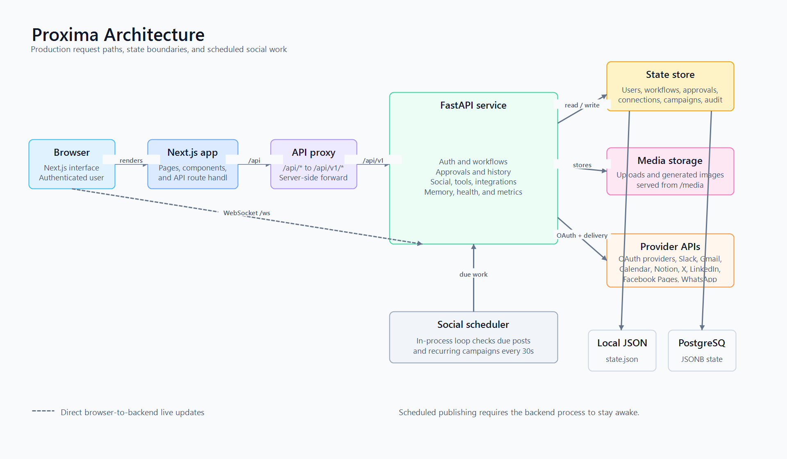
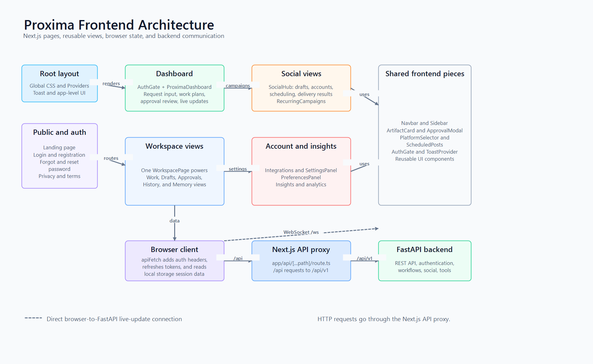
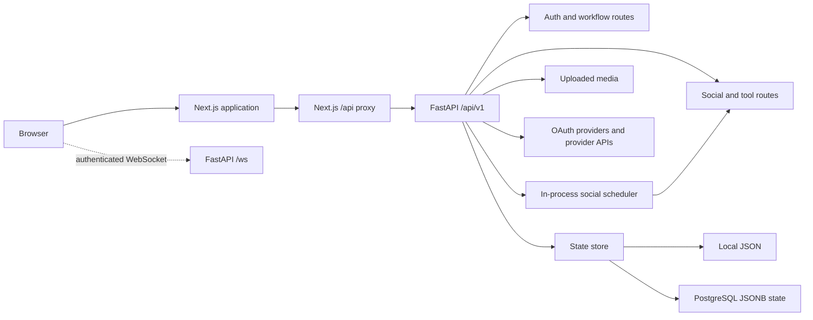

# Proxima architecture

This note describes the repository as it runs today. It is for contributors who need to find the request paths, data boundaries, and background work before making a change.

## Frontend diagram

## Request flow

1. The browser loads the Next.js application.
2. Browser requests to `/api/*` are handled by `frontend/app/api/[...path]/route.ts`. The proxy forwards them to FastAPI under `/api/v1/*`.
3. FastAPI authenticates the request, reads or updates the state store, and returns the response through the proxy.
4. The dashboard opens a separate authenticated WebSocket directly to FastAPI at `/ws`. It sends a token as a query parameter and receives connection and heartbeat events. The WebSocket does not pass through the Next.js proxy.
5. OAuth callbacks return to FastAPI, which records the provider connection and redirects the browser back to the frontend integration page.

The backend mounts the same API application at both `/api/v1` and `/api` for compatibility. It also exposes `/health` for host health checks, `/media` for stored uploads, and redirects `/` to its API documentation route.

## Frontend

- `frontend/app` contains page routes for the public pages and dashboard views.
- `frontend/components` contains the workspace, approval, integration, social, campaign, and history interfaces.
- `frontend/lib/proxima-api.js` adds authentication headers, handles refresh-token retries, and is the common browser API client.
- `frontend/app/api/[...path]/route.ts` is the server-side proxy. In hosted environments it requires `PROXIMA_API_BASE_URL` (or `NEXT_PUBLIC_API_URL`) to point to the backend.

The frontend keeps the access and refresh tokens in browser local storage. It uses the access token when calling the API and when establishing the WebSocket connection.

## Backend

`backend/app/main.py` creates the FastAPI application and registers these route groups:

- `auth`: registration, sign-in, token refresh, sign-out, password reset, and current-user lookup.
- `workflows`: intent analysis, prepared drafts, work plans, editable artifacts, approvals, reruns, cancellation, and dashboard data.
- `approvals`: pending approval lists and approve, reject, defer, resume, and batch actions.
- `social`: social drafts, image uploads and generation, account selection, publishing, scheduled posts, recurring campaigns, and delivery records.
- `tools` and `integrations`: provider discovery, OAuth connection flows, disconnects, Slack notification channels, Slack messages, and supported provider actions.
- `history` and `memory`: saved work, exports, reruns, and user memory records.
- `health`, `metrics`, and `deploy`: health checks, Prometheus-style metrics, and workflow deployment helpers.

`backend/app/core/security.py` handles authentication, `core/crypto.py` encrypts saved provider tokens, and `core/realtime.py` manages connected WebSocket clients. Logging, rate limiting, CORS, and unhandled-exception handling are installed as middleware in `main.py`.

## State and media

`backend/app/core/store.py` is the current persistence boundary. It keeps application state as one JSON document:

- Local development uses `PROXIMA_DATA_DIR/state.json`.
- Hosted deployments can set `PROXIMA_STORAGE_BACKEND=postgres` and provide `PROXIMA_DATABASE_URL`. The same JSON document is stored in the `proxima_state` PostgreSQL table as JSONB.

This state includes users, workflows, approvals, artifacts, provider connections, social posts, recurring campaigns, media records, and audit data. Provider access tokens are encrypted before they are written to the store.

Uploaded and generated image files are stored below `PROXIMA_DATA_DIR/uploads` and served at `/media`. Images can be prepared and previewed in a campaign, but provider media upload is not implemented; current social delivery sends text posts.

## Connected services

The tool registry includes Gmail, Google Calendar, Slack, Notion, X, LinkedIn, Facebook Pages, and WhatsApp Business. Each provider requires its own credentials, approved callback URL, permissions, and, where relevant, an account connection.

The social delivery route currently has concrete text-publishing paths for X, LinkedIn, Facebook Pages, and WhatsApp. Slack has a separate message route. A connected provider is not a guarantee that every action is enabled: provider credentials, account permissions, and the specific action must all be available.

## Draft generation and approvals

When `OPENAI_API_KEY` is configured, the backend uses the configured Proxima model settings to create work drafts and channel-specific social drafts. Social drafting falls back to clearly marked template copy if generation is unavailable. Generated drafts remain editable and are intended to be reviewed before an external action is approved.

Approval records and workflow state are stored before an external action is sent. Delivery results are saved on the relevant social post or workflow record so the user can see whether a provider accepted or rejected the action.

## Scheduled and recurring social work

At application startup, `main.py` starts `social.scheduler_loop()` as an asyncio task. At the interval set by `PROXIMA_SOCIAL_SCHEDULER_INTERVAL_SECONDS` (30 seconds by default), it:

1. Finds due scheduled social posts and delivers them.
2. Finds due recurring campaigns, prepares the next topic angle, creates the post record, delivers it, and calculates the next run time.

This is intentionally an in-process scheduler: it needs one continuously running backend process. A host that sleeps, restarts, or runs multiple uncoordinated replicas can delay or duplicate time-sensitive work. A durable job queue or managed scheduler is the next architectural step for strict production delivery guarantees.
