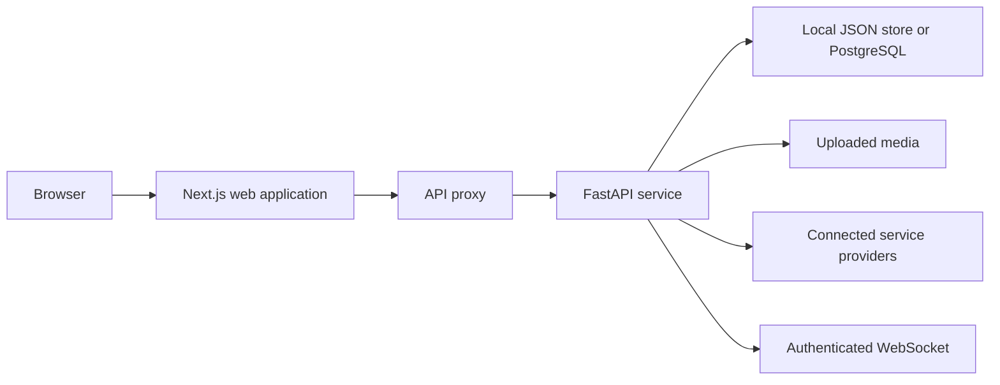

# Proxima architecture

This note describes the repository as it runs today. It is intended for contributors who need to find the main request paths and service boundaries.

## Request flow

1. The browser sends requests to the Next.js application.
2. The application proxy forwards API requests to the FastAPI `/api/v1` routes.
3. FastAPI authenticates the request, reads or updates stored data, and returns a response.
4. Signed-in browsers receive work updates through `/ws`.

## Main components

- `frontend/app/api/[...path]/route.ts` forwards browser API requests to the backend.
- `backend/app/routes/auth.py` handles registration, sign-in, token refresh, sign-out, and password recovery.
- `backend/app/routes/workflows.py` stores requests, plans, approvals, results, and activity records.
- `backend/app/routes/integrations.py` manages provider connection flows.
- `backend/app/routes/tools.py` contains supported provider actions, including Slack message delivery.
- `backend/app/core/store.py` selects the local or PostgreSQL-backed store.

## Storage and media

Local development uses the data directory set by `PROXIMA_DATA_DIR`. Hosted environments can use PostgreSQL by setting `PROXIMA_STORAGE_BACKEND=postgres` and `PROXIMA_DATABASE_URL`.

Uploaded media is stored below `PROXIMA_DATA_DIR/uploads` and served from `/media`.

## Connected services

Each connected provider requires its own credentials and approved callback URL. The application stores connection credentials in encrypted form. A connection alone does not guarantee every provider action is available; an action must be implemented and enabled by that provider.
