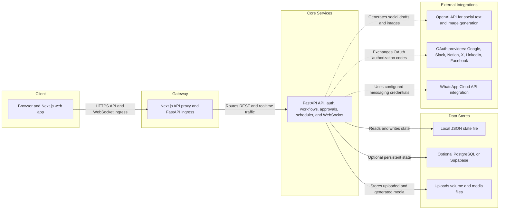

# Proxima OS architecture

This diagram reflects the current repository implementation. The editable FigJam version is available here:

[Open the Proxima OS Architecture diagram in FigJam](https://www.figma.com/online-whiteboard/create-diagram/7cb59e2d-6bb7-408c-ba6b-a41edf1d7715?utm_source=other&utm_content=edit_in_figjam&oai_id=v1%2FDbNRtSfRjZu1YxQp4R4Q7Qn3QS1H6ox91lvA3M5cVr0bZqV3Cml1b4&request_id=91084815-d651-4919-be87-b73141205548&architecture=true)

## Runtime notes

- `frontend/app/api/[...path]/route.ts` proxies browser API requests to the backend `/api/v1` mount.
- The FastAPI process owns authentication, password recovery, workflows, approvals, memory, integrations, social publishing, metrics, and the authenticated `/ws` endpoint.
- Local JSON state is the default storage adapter. PostgreSQL/Supabase is an optional replacement selected by `PROXIMA_STORAGE_BACKEND=postgres`.
- Uploaded and generated media is stored below `PROXIMA_DATA_DIR/uploads` and served through `/media`.
- OpenAI and OAuth providers are optional external boundaries and require their corresponding environment variables.
- WhatsApp is represented as a server-managed integration boundary. It remains unconfigured without `WHATSAPP_ACCESS_TOKEN` and `WHATSAPP_PHONE_NUMBER_ID`; provider delivery still depends on the configured integration action.
